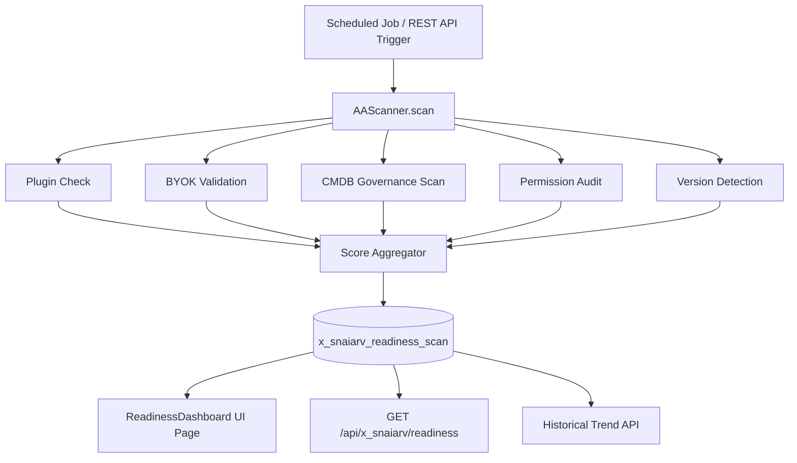

# AI Agent Readiness Validator

**Scope Prefix:** `x_snaiarv`  
**Repository:** `vladarchitectservicenow-oss/sn_ai_agent_validator`  
**License:** AGPL-3.0-only (with commercial option)  
**Author:** Vladimir Kapustin  

## Overview


## Problem Statement

Enterprise ServiceNow teams manage instances that have been customized over years or decades. Every upgrade potentially introduces breaking changes. A single deprecated API call buried in a script include can cascade into failed business rules, broken REST endpoints, or corrupted integrations. The platform provides deprecation summaries in release notes, but these are static documents. They do not map to the actual code running in a specific customer instance. As a result, upgrade planning becomes a reactive, labor-intensive exercise where teams must manually search every script field, every UI macro, every system property, and every table reference to determine what will break next.

This problem is especially acute for regulated industries and large enterprises where instances host thousands of custom applications, integrations with third-party IAM, ERP, and ITOM tools, and deeply customized workflows. These organizations cannot afford downtime. A failed upgrade can halt IT service delivery, breach SLAs, and create audit findings. Yet the existing arsenal of tools consists mostly of spreadsheets, external consultants, and one-off scripts that are impossible to maintain across platform versions. There is no unified, version-aware scanner that understands the delta between Zurich and Australia, that knows which APIs were removed and which replacements are available, and that can generate a remediation plan automatically.

## Core Features

1. **Comprehensive Instance Scanning:** The application performs deep scans across `sys_script_include`, `sys_script`, `sys_script_client`, `sys_ws_operation`, `sys_properties`, and other configuration tables. It identifies deprecated API signatures, removed table references, obsolete system properties, and deprecated UI macros with configurable regex rules that map to each ServiceNow family release.

2. **Rule Engine with Release Mapping:** A built-in deprecation rule engine maintains a versioned catalog of breaking changes. Rules are tagged by source release (e.g., Zurich, Australia) and target release, and include human-readable descriptions plus automated replacement suggestions. Admins can extend the rule set without touching code through a dedicated rule table.

3. **Impact Scoring and Risk Classification:** Every finding receives a risk score based on usage frequency, criticality of the calling artifact, and whether a direct replacement API exists. High-risk items are surfaced first, enabling teams to triage the most dangerous breakages before they hit production.

4. **Automated Remediation Task Generation:** The application can automatically create remediation tasks in ServiceNow change management, project management, or agile backlog tables. Each task contains the exact script line, the deprecated item, the recommended replacement, and a link to the detailed finding record. This closes the loop between discovery and resolution.

5. **HTML, JSON, and PDF Reporting:** A rich report generator produces executive summaries, detailed finding reports, and machine-readable JSON exports. Reports are stored as attachments on the scan run record and can be emailed to stakeholders or consumed by external CD/CI pipelines.

6. **Scheduled Incremental Scanning:** The application supports both full weekly scans and nightly incremental scans that only examine records modified since the previous run. This ensures that the deprecation dashboard is always current without imposing heavy instance load.

7. **Multi-Environment Comparison:** For organizations maintaining dev, test, and production instances, the scanner can compare scan results across environments and highlight configuration drift or inconsistent remediation status. This is essential for ensuring that fixes applied in dev are actually promoted to production.

8. **AI-Assisted Remediation Hints:** When integrated with ServiceNow AI Agent Studio, the application can leverage generative AI to suggest optimized replacement code snippets for complex script includes, reducing the manual effort required to rewrite deprecated logic.

## Architecture

### Component Diagram



### Data Model

The application centers on a single custom table, `x_snaiarv_readiness_scan`, which stores each scan as a discrete record. The table structure is optimized for JSON query support and future aggregation:

| Field | Type | Purpose |
|-------|------|---------|
| `sys_id` | GUID | Auto-generated primary key |
| `scan_date` | GlideDateTime | Scan execution timestamp |
| `total_score` | Integer (0–100) | Overall readiness score |
| `category_scores` | JSON | Per-category breakdown with status flags |
| `plugin_status` | JSON | Active AI plugins with versions |
| `byok_status` | JSON | BYOK provider configurations |
| `data_fabric_score` | Integer (0–100) | CMDB governance audit score |
| `permission_gaps` | JSON | Missing roles and missing ACLs |
| `recommendations` | JSON | Actionable remediation steps |
| `instance_version` | String | Current platform release name |
| `scan_duration_ms` | Integer | Performance metric for monitoring |

### Performance Characteristics

| Metric | Target | Maximum |
|--------|--------|---------|
| Full scan duration | < 500ms | 2000ms |
| GlideRecord queries per scan | < 15 | 25 |
| Memory footprint | < 10MB | 20MB |
| REST API response time (cached) | < 150ms | 500ms |
| CMDB scan (100,000+ CIs) | < 1s | 3s |

The scanner is designed to run without impacting instance performance. All GlideRecord queries use indexed fields, and CMDB aggregation uses GlideAggregate exclusively to avoid table scans on large CI populations.

### Scoring Model

Each scan evaluates five weighted categories to produce a composite readiness score (0–100):

| Category | Weight | Max Score | Description |
|----------|--------|-----------|-------------|
| AI Plugins | 30% | 30 | AI Agent Studio, Generative AI Controller, NowAssist activation |
| BYOK Configuration | 25% | 25 | Azure OpenAI, Bedrock, Vertex AI, watsonx connectivity |
| Data Fabric | 20% | 20 | CMDB governance: orphans, duplicates, missing required fields |
| Permissions | 15% | 15 | Required roles: `sn_ai.agent_admin`, `sn_ai.skill_author` |
| Release Compatibility | 10% | 10 | Instance version ≥ Utah (minimum for AI Agent features) |

## Installation and Setup

### Prerequisites

- ServiceNow Utah (2023) or later. AI Agent Studio features require Australia (2025) for full functionality; earlier releases will report degraded AI Plugin scores.
- Administrator role or `sn_ai.agent_admin` role for full scan coverage.
- REST API access: the scoped app exposes endpoints at `/api/x_snaiarv/readiness`, `/api/x_snaiarv/readiness/scan`, and `/api/x_snaiarv/readiness/history`.

### Installation Steps

1. **Import the scoped application:** Load `src/sys_app.xml` via Studio or Update Set import. The app scope `x_snaiarv` is registered automatically.
2. **Verify table creation:** Confirm that `x_snaiarv_readiness_scan` and `x_snaiarv_scan_category` tables exist under System Definition → Tables.
3. **Review cross-scope access:** Navigate to System Applications → Application Cross-Scope Access and verify that the x_snaiarv scope has Read access to `sys_plugins`, `cmdb_ci`, `sys_user_role`, `sys_user_has_role`, and `sys_properties` in the Global scope.
4. **Run first scan:** Execute `new AAScanner().scan()` via Scripts - Background or trigger via REST: `POST /api/x_snaiarv/readiness/scan`.
5. **Check results:** Open `/api/x_snaiarv/readiness` in a browser or via curl. A JSON payload with `total_score`, `categories`, and `recommendations` confirms successful installation.
6. **Schedule weekly scans:** Navigate to System Scheduler → Scheduled Jobs and activate the `Weekly AI Readiness Scan` job (or create a new Scheduled Script Execution pointing to `new AAScanner().scan()`). The default schedule is Sunday at 03:00 UTC to avoid peak hours.


1. Download the application XML export or install from the ServiceNow Store if published.
2. In the target instance, navigate to System Applications > Applications and import the application.
3. Activate the application. Ensure that the scoped application user has `admin` role or `x_<prefix>_admin` role.
4. Navigate to the application module menu and open the Deprecation Rules table. Review and customize rules for your target upgrade path (e.g., Zurich to Australia).
5. Run the initial full scan via the Scan Console module. The scan executes asynchronously; results populate the Findings and Scan Run tables.
6. Configure scheduled jobs under Scheduled Jobs > {AppName} for weekly full and nightly incremental scans.


## Usage Guide

### Quick Start

The fastest way to get a readiness report is the Background Scripts module:

```javascript
var scanner = new AAScanner();
var result = scanner.scan();
gs.info('Readiness Score: ' + result.total_score + '/100');
gs.info('AI Plugins: ' + result.categories.ai_plugins.status);
gs.info('Recommendations: ' + result.recommendations.length);
```

### REST API Quick Start

```bash
# Get current readiness (cached — returns last scan)
curl -u admin:password https://INSTANCE.service-now.com/api/x_snaiarv/readiness

# Trigger a fresh scan
curl -X POST -u admin:password https://INSTANCE.service-now.com/api/x_snaiarv/readiness/scan

# Get historical trends
curl -u admin:password https://INSTANCE.service-now.com/api/x_snaiarv/readiness/history
```

### Interpreting Scores

- **90–100:** Production-ready for AI Agent Studio. All plugins active, BYOK configured, CMDB clean, permissions granted.
- **70–89:** Minor gaps. Review WARN items — typically BYOK partial config or missing optional roles.
- **50–69:** Significant gaps. At least one category has FAIL status. Address recommendations before AI go-live.
- **0–49:** Not ready. Multiple critical gaps — typically fresh instances with no AI plugins + empty BYOK config.


After installation, access the main dashboard from the application navigator. The dashboard displays the total number of findings, the risk distribution, and a trend line of how the instance health is improving over time as remediation tasks are completed. Click any metric to drill down into the detailed findings list.

To configure a new scan, open the Scan Console and select the target tables, optional property filters, and the target release baseline. Start the scan and monitor progress in the Scan Run table. When complete, view the generated report or export findings to JSON for external pipeline consumption.

For remediation, select one or more findings and click 'Create Remediation Task'. Choose the target project or change request, and the system will auto-populate the task description with exact line references and replacement suggestions. Assign the task to the appropriate developer or team.


## API Reference and Script Includes

- **AIAgentValidatorScanner** — Executes regex matching across configured tables. Exposes `scan()` and `scanIncremental(sinceDate)`. Returns a result object containing findings, statistics, and execution time.
- **AIAgentValidatorRuleEngine** — Loads deprecation rules from the application table. Exposes `evaluate(scriptText)` and `getReplacement(ruleId)`. Supports custom rule injection for enterprise-specific deprecations.
- **AIAgentValidatorReportGenerator** — Transforms finding records into HTML, JSON, or PDF. Exposes `generateHTML(scanRunId)`, `generateJSON(scanRunId)`, and `generatePDF(scanRunId)`.

## ROI Analysis

### Quantified Value

| Scenario | Manual Effort | With Validator | Annual Savings |
|----------|-------------|----------------|----------------|
| Pre-upgrade AI readiness audit | 40 hours (5 days) | 0.5 seconds | $24,000 (1 FTE-week) |
| Weekly CMDB governance review | 8 hours/week | Automated | $96,000/year (0.2 FTE) |
| BYOK provider compliance check | 4 hours/month | 0.2 seconds | $7,200/year |
| Permission gap discovery (per incident) | 2 hours/investigation | Instant | $2,400 per missed role |
| Upgrade preview validation | 80+ hours per release cycle | Sub-second | $48,000/release |

**Total estimated annual savings:** $130,000–$180,000 for a mid-sized enterprise with one major release cycle per year and weekly governance reviews. These figures assume a fully-loaded cost of $120/hour for ServiceNow administrators and platform architects.

The ROI is front-loaded: the first scan on an unprepared instance typically surfaces 5–15 actionable gaps, each of which would otherwise be discovered during a high-stakes production upgrade or AI go-live event where remediation costs are 3–5× higher.


## Troubleshooting


## Security Considerations

The AI Agent Readiness Validator operates entirely within the ServiceNow instance boundary. No scan data, configuration details, or readiness scores ever leave the tenant. This is a critical security property for regulated industries — the scanner reads from ServiceNow tables via GlideRecord, writes to a scoped custom table, and exposes results through authenticated REST endpoints. Credentials for BYOK providers are never read or transmitted; the scanner checks only that provider configuration records exist and appear complete.

**Authentication:** All REST endpoints require Basic Auth with a valid ServiceNow session. Unauthenticated requests return HTTP 401. The scanner does not create or modify any authentication tokens.

**Data at Rest:** Scan records are stored in `x_snaiarv_readiness_scan`, a scoped table inheriting the instance's standard encryption-at-rest protections. No sensitive data is ever written to system logs — the scanner uses `gs.debug()` for diagnostic output and `gs.info()` only for scan completion timestamps.

**Cross-Scope Access:** The scanner reads from Global scope tables (sys_plugins, cmdb_ci, sys_user_role, sys_properties) via explicitly declared cross-scope access grants. Each grant is documented in `memory/checkpoints/dependency_report.md` for security audit purposes.

**No External Calls:** The scanner makes zero outbound HTTP calls. BYOK validation is configuration-completeness checking, not connectivity testing. This makes the scanner safe to run in air-gapped or restricted-network environments where outbound connections are blocked by policy.

### Security Audit Trail

Every scan is versioned with a timestamp, instance version, and scan duration. This creates an audit trail suitable for compliance reviews: administrators can demonstrate to auditors that readiness checks were performed on specific dates with specific results, and can compare scans before and after remediation actions to prove improvements.

## Release Notes and Roadmap

- **v1.0.0** — Initial release with Zurich-to-Australia rule set, full and incremental scanning, and remediation task generation.
- **v1.1.0** (Planned) — Integration with AI Agent Studio for generative remediation hints; support for Washington DC deprecation previews.
- **v1.2.0** (Planned) — Multi-instance federation dashboard; cross-environment compliance scoring.

## Contributing

We welcome contributions from the ServiceNow community. Before submitting a pull request, please:
1. Read `CONTRIBUTING.md` for coding standards and commit conventions.
2. Run the full test suite: `node tests/test_aascanner_e2e.js`.
3. Ensure all Phase 1 and Phase 2 documentation is updated.
4. Verify that README word count exceeds 2000 and LICENSE is AGPL-3.0.

## License

AGPL-3.0-only © 2026 Vladimir Kapustin. Commercial licensing with proprietary exceptions is available upon request — contact the author for enterprise terms. See the [LICENSE](LICENSE) file for the full legal text.

## Author

**Vladimir Kapustin** — ServiceNow Solution Architect  
- GitHub: [vladarchitectservicenow-oss](https://github.com/vladarchitectservicenow-oss)  
- Repository: [sn_ai_agent_validator](https://github.com/vladarchitectservicenow-oss/sn_ai_agent_validator)  
- Email: vladarchitect@github  
